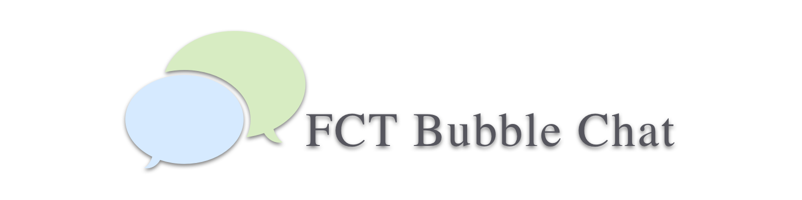
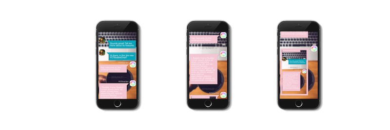

<p align="center">
  
</p>

**FCTBubbleChat** makes it easy to create a chatting view controller in your project

```swift
let bubbleTableSample = FCTBubbleChatTableView(frame: self.bounds)
bubbleTableSample.bubbleDatasource = self
            
self.view.addSubview(bubbleTableSample)
```

<p align="center">
    <a href="#features">Features</a> • <a href="#usage">Usage</a> • <a href="#demo">Demo</a> • <a href="#references">References</a> • <a href="#installation">Installation</a> • <a href="#license">License</a>
</p>

## Features

- [x] Bubble table generated with code, not external ressources
- [ ] Fully customizable (still ongoing)
- [ ] Documented (still ongoing)
- [ ] A set of method for UX (still ongoing)

## Usage

- **Feed your bubble table with designed data**

**With text content**
```swift
let data1 = FCTBubbleData(userName: "MyName", userPic: UIImage(named:"MyAvatar"), date: NSDate(), stringContent: "Hello World!", type: .Mine, contentType: .Text)
```

**or picture**

```swift
let data2 = FCTBubbleData(userName: "Someone", userPic: UIImage(named: "Someone_avatar"), date: NSDate(), imageContent: UIImage(named: "sample_picture")!, type: .Other, contentType: .Image)
```

> See [more about FCTBubbleData initialization](#initialization)

- **Your `FCTBubbleChatTableView` can be customized by several attributes**

```swift
bubbleTableSample.avatarMode = true
bubbleTableSample.bubbleMineColor = UIColor.redColor()
```

> See [all the attributes](#attributes)

- **Improve your User eXperience with custom methods**

```swift
bubbleTableSample.scrollToBottom(true)
```

> See [all the methods](#methods)

## Demo

<p align="center">
  
</p>

## References

### Initialization

* FCTBubbleData
  * init(userName: String?, userPic: UIImage?, date: NSDate, stringContent: String, type: FCTBubbleDataType, contentType: FCTBubbleContentType)

| Parameter     | Description                                   |
|---------------|-----------------------------------------------|
| userName      | Bubble username                               |
| userPic       | Bubble avatar picture                         |
| date          | Bubble date                                   |
| stringContent | Bubble message content                        |
| type          | Bubble type. Will define the tail orientation |
| contentType   | Bubble content type. Will lead the content    |

  * init(userName: String?, userPic: UIImage?, date: NSDate, imageContent: UIImage, type: FCTBubbleDataType, contentType: FCTBubbleContentType)

| Parameter    | Description                                   |
|--------------|-----------------------------------------------|
| userName     | Bubble username                               |
| userPic      | Bubble avatar picture                         |
| date         | Bubble date                                   |
| imageContent | Bubble picture                                |
| type         | Bubble type. Will define the tail orientation |
| contentType  | Bubble content type. Will lead the content    |

### Attributes

| Name                | Description                              | Type    | Example                                                                                         |
|---------------------|------------------------------------------|---------|-------------------------------------------------------------------------------------------------|
| bubbleFont          | The font of your bubble text content     | UIFont  | table.bubbleFont = UIFont(name: "HiraKakuProN-W3", size: 20.0)!                                 |
| bubbleFontColor     | The color of the bubble text content     | UIColor | table.bubbleFontColor = UIColor.whiteColor()                                                    |
| avatarNameFont      | The font of the avatar name label        | UIFont  | table.avatarNameFont = UIFont(name: "HiraKakuProN-W3", size: 15.0)!                             |
| avatarNameFontColor | The color of the avatar name label       | UIColor | table.avatarNameFontColor = UIColor.redColor()                                                  |
| avatarMode          | Display the avatar mode (default: false) | Bool    | table.avatarMode = false                                                                        |
| bubbleMineColor     | The color for the bubble of type .Mine   | UIColor | table.bubbleMineColor = UIColor(red: 0/255.0, green: 166/255.0, blue: 186/255.0, alpha: 1.0)    |
| bubbleOtherColor    | The color for the bubble of type .Other  | UIColor | table.bubbleOtherColor = UIColor(red: 244/255.0, green: 198/255.0, blue: 211/255.0, alpha: 1.0) |
| displayShadow       | Display shadow (default: false)          | Bool    | table.displayShadow = true                                                                      |

### Methods

| Method                         | Description                                                        |
|--------------------------------|--------------------------------------------------------------------|
| scrollToBottom(animated: Bool) | Scroll your bubble table to its bottom, displaying the last bubble |

## Installation

Todo...

## License

Copyright (c) 2016 SebastienFCT

Permission is hereby granted, free of charge, to any person obtaining a copy
of this software and associated documentation files (the "Software"), to deal
in the Software without restriction, including without limitation the rights
to use, copy, modify, merge, publish, distribute, sublicense, and/or sell
copies of the Software, and to permit persons to whom the Software is
furnished to do so, subject to the following conditions:

The above copyright notice and this permission notice shall be included in all
copies or substantial portions of the Software.

THE SOFTWARE IS PROVIDED "AS IS", WITHOUT WARRANTY OF ANY KIND, EXPRESS OR
IMPLIED, INCLUDING BUT NOT LIMITED TO THE WARRANTIES OF MERCHANTABILITY,
FITNESS FOR A PARTICULAR PURPOSE AND NONINFRINGEMENT. IN NO EVENT SHALL THE
AUTHORS OR COPYRIGHT HOLDERS BE LIABLE FOR ANY CLAIM, DAMAGES OR OTHER
LIABILITY, WHETHER IN AN ACTION OF CONTRACT, TORT OR OTHERWISE, ARISING FROM,
OUT OF OR IN CONNECTION WITH THE SOFTWARE OR THE USE OR OTHER DEALINGS IN THE
SOFTWARE.

## Buy me a coffee? :coffee:

My work is totally free of use/reuse/modification. I love open-sourcing as least as much as I love programming

Anyway, If you like it feel free to ask for [improvement](https://github.com/SebastienFCT/FCTBubbleChat/issues), [email me](mailto:sebastienfct@gmail.com) and/or donate:

| Paypal | Bitcoin |
| ------ | ------- |
| [](https://www.paypal.me/sebastienfct) |  <center> [](https://sebastienfct.bitcoinwallet.com/) </center> |
